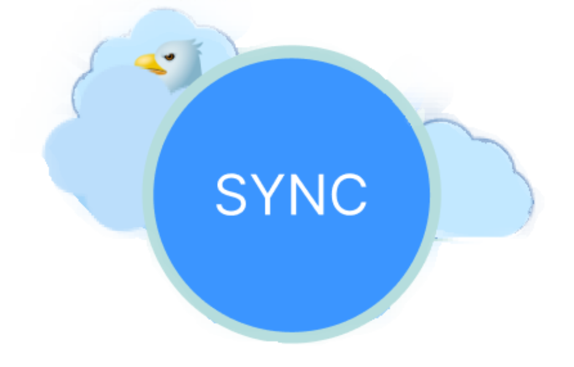

# PyCloud

### Программа для синхронизации папок, пк → облако и облако → пк


<!--Установка-->
## Установка
1. Клонирование репозитория 

```git clone https://github.com/go2swim/PyCloud.git```

2. Переход в директорию PyCloud

```cd PyCloud```

3. Установка зависимостей

```pip3 install -r requirements.txt```

4. Начало работы с консольной версией

``` python pyCloud.py --help```

5. Начало работы с оконной версией

```python gui.py```

<!--зависимости-->
## Зависимости
Эта программа зависит от интепретатора Python версии 3.7 или выше, PIP 23.2.1 или выше.

<!--Описание-->
## Описание

### Консольная версия
Добавьте папку которую хотите синхронизировать с облаком  ```python pyCloud.py add-folder <cloud path>```
и запустите синхронизацию ```python pyCloud.py sync-cloud```, при дальнейших синхронизациях будут обновляться только изменённые файлы. 
Для обратной синхронизации используйте ```python pyCloud.py sync-pc```, в этом случае файлы в синхронизированой папке станут в точности как на пк.
Чтобы ознакомиться со всеми командами ```python pyCloud.py --help```

### Оконная версия
Добавьте папки для синхронизации: \
Выберите облака:


\
Синхронизируйте файлы: 

<!--Структура-->
## Структура
Весь код находиться в папке src, тесты в папке src/Tests\
Покрытие тестами: >80%

<!--Авторы-->
### Автор: Волков Андрей
